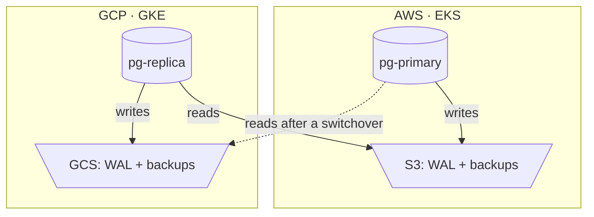

# Architecture diagram

The source of the diagram in the [README](../README.md) (`high_level.png`).

```mermaid
flowchart TB
  subgraph AWS["AWS · EKS"]
    primary[("pg-primary")]
    s3[\"S3: WAL + backups"/]
  end
  subgraph GCP["GCP · GKE"]
    replica[("pg-replica")]
    gcs[\"GCS: WAL + backups"/]
  end
  primary -- "writes" --> s3
  replica -- "reads" --> s3
  replica -- "writes" --> gcs
  primary -. "reads after a switchover" .-> gcs
```
